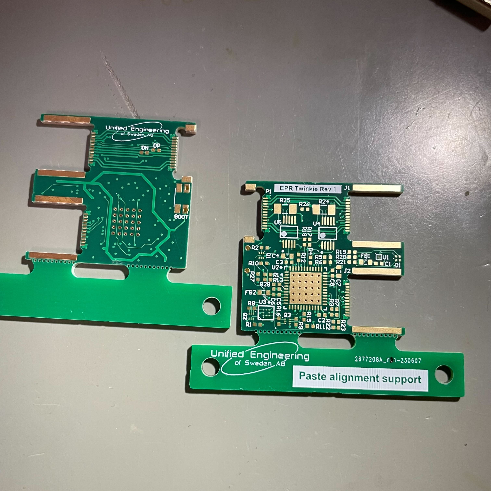
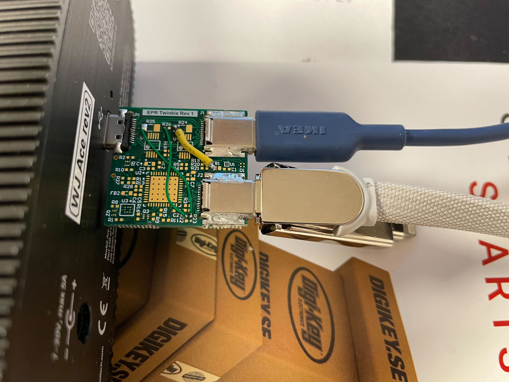
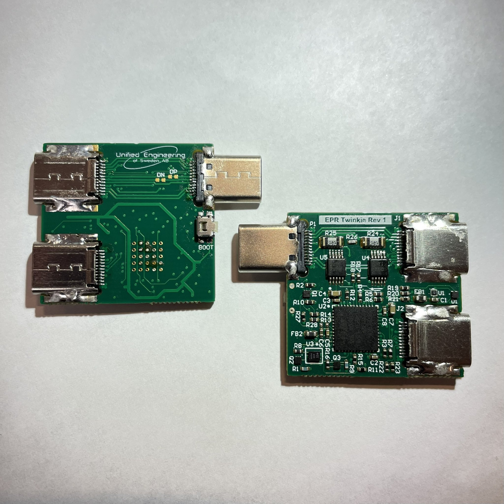
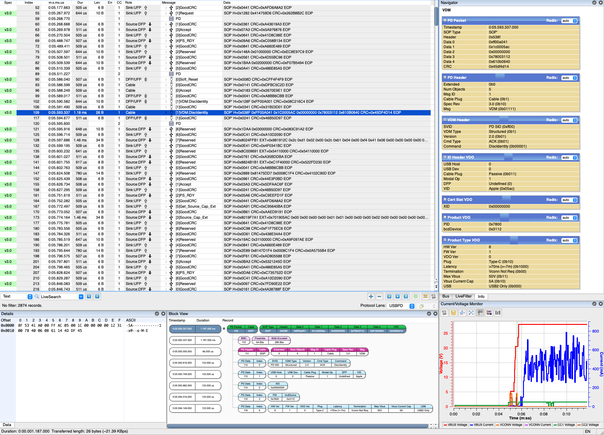

# EPRTwinkie
EPR (USB PD 3.1) capable PD sniffer based on Google Twinkie (https://www.chromium.org/chromium-os/twinkie) and inspired by https://github.com/dojoe/Twonkie and https://github.com/gregdavill/PD-sniffer

This hardware will run BMC USBPD capture with unmodified Twinkie firmware but VBUS/VCONN voltage and current readout won't work without some minor modifications:

INA231 bus voltage location is register 0x02, INA237 location is 0x05
INA231 bus voltage multiplier is 2.5mV/LSB, INA237 is 3.125mV/LSB

INA231 current location is register 0x04, INA237 location is 0x07
INA231 shunt calibration location is register 0x05, INA237 location is 0x02
Shunt calibration needs to be changed to 0x6000 for INA237 with 30mOhm resistors as used in this design

Alert and mask settings are also different but I haven't touched those yet.

Boards

Special variant which enables the use of a computer with limited supply capabilities in combination with a USB PD adapter to supply a USB PD capable USB peripheral

Fully assembled EPR Twinkie boards

Example EPR capture (don't have any devices capable of >28V yet)
